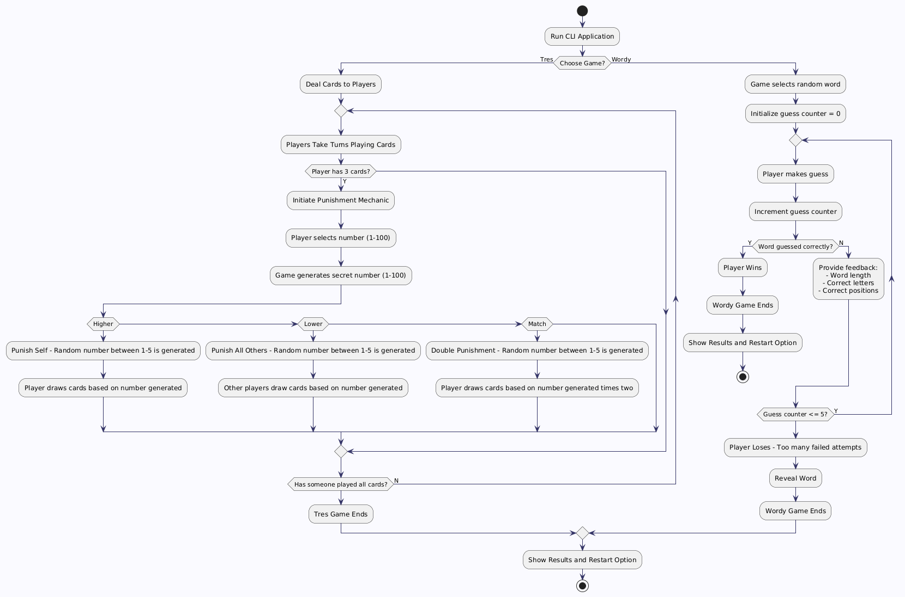

Team Name: CTRL UNO

Team Members: Jabriel Neal, Gavin Knotts, Joshua Casey.

Project option: create a replication of the word game “Wordle”, and if time permitted, “Uno”

Description: Create a simple replica of “Wordle” in Python, and if time and skill permit, a couple of other games that the user will be able to select through and play.

Communication Plan: We have a dedicated workspace for this project. It will allow team members to access and edit the same program simultaneously (similar to a Google Doc), using a combination of GitHub and VS Code.

Milestone and Deliverable Schedule: Regular Wordle-2-3 weeks from now, Wordle w/ difficulty levels- 3-4 weeks from now, more games- 5-6 weeks from now, Interviews/testing 6-7 weeks from now

Work Breakdown Structure: Gavin Knotts- Input/Output, Jabriel Neal- Processing, and Joshua Casey- Graphics.

Flow Chart:

Risk management plan: With our shared workspace, inclement weather, file corruption, or team member unavailability will not be a problem.
